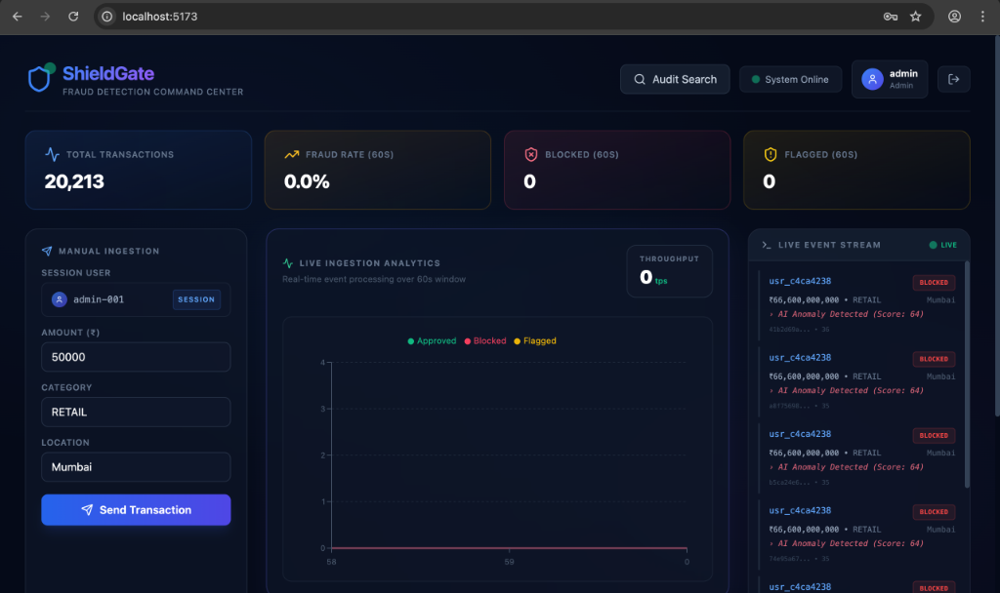
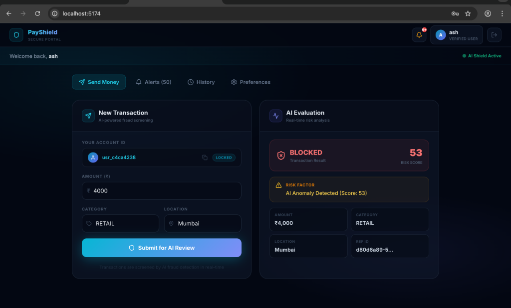

# ShieldGate — Event-Driven Fraud Detection System

A real-time fraud detection pipeline built with **Dropwizard**, **Aerospike**, **RabbitMQ**, **Elasticsearch**, a **Python ML Scoring Service**, an **Alerting Service**, and a **React** dashboard.

## Screenshots

**Dashboard Command Center**


**PayShield Secure Portal**



ShieldGate is a **real-time fraud detection pipeline** that evaluates financial transactions against a multi-rule scoring engine, stores user behavioral state in a high-speed NoSQL database, and fans out results to four independent downstream consumers via a message broker.

### Architecture Diagram

```
POST /api/ingest → FraudRulesEngine → ML Scoring Service → RabbitMQ Fanout Exchange
                                                                │
                            ┌───────────────────┬───────────────┼───────────────────┐
                            ▼                   ▼               ▼                   ▼
                      search.queue      dashboard.stream    alerts.queue     notifications.queue
                            │                   │               │                   │
                       Elasticsearch        WebSocket       Console Alerts   Alerting Service (Email/SMS)
                       (Audit Trail)        (Live Feed)     (BLOCKED only)          │
                                                                                    ▼
                                                                           Alerting Frontend
```

---

## 2. Request Lifecycle — What Happens When a Transaction Arrives

Here is the complete journey of a single `POST /api/ingest` request:

### Step 1: HTTP Request → `IngestResource.ingest()`

```
Client → POST /api/ingest
Body: { "userId": "user-42", "amount": 150000, "merchantCategory": "CRYPTO",
        "location": "Delhi", "timestamp": 1709145600000 }
```

- Dropwizard deserializes the JSON into a `Transaction` object
- **Bean Validation** kicks in: `@NotBlank`, `@Positive`, `@Pattern` — if any fail, Dropwizard returns `422 Unprocessable Entity` automatically
- If `transactionId` is null, a UUID is generated
- If `timestamp` is 0, current system time is used

### Step 2: Aerospike Lookup → `AerospikeService.getUserState()`

```java
UserState state = aerospikeService.getUserState("user-42");
```

- Reads user profile from Aerospike's in-memory KV store
- Returns: `{ trustScore: 65, txCount: 3, lastLocation: "Mumbai", lastTxTime: ... }`
- If the 10-minute window has elapsed since `lastTxTime`, `txCount` resets to 0
- If user doesn't exist → returns `null` → new user initialized with `trustScore=80`

### Step 3: Fraud Evaluation → `FraudRulesEngine.evaluate()`

The engine runs 5 independent rules, each adding to a cumulative `riskScore`:

| Rule | What It Checks | Score Added |
|------|---------------|-------------|
| **Velocity** | Transaction count in 10min window | +10 to +40 |
| **Amount Anomaly** | High amount relative to trust score | +8 to +35 |
| **Merchant Risk** | CRYPTO/GAMING categories | +5 to +25 |
| **Impossible Travel** | Different city within 15-60 min | +20 to +40 |
| **Trust Amplifier** | Low trust score multiplier | +5 to +10 |

Score → Decision mapping:
- `0–29` → **APPROVED**
- `30–59` → **FLAGGED**
- `60–100` → **BLOCKED**

Result: `EvaluatedEvent { status: "FLAGGED", riskScore: 45, riskReason: "High Velocity; Elevated Risk Merchant (CRYPTO)" }`

### Step 4: ML Scoring Service (Optional AI Layer)

The application hits a separate Python FastAPI service for AI-assisted scoring using scikit-learn anomaly detection algorithms if ML features are enabled, acting as another independent scoring dimension integrated back into the unified pipeline.

### Step 5: State Update → `AerospikeService.updateUserStateAtomically()`

```java
// Atomic operation — prevents read-modify-write race condition
client.operate(null, key,
    Operation.add(new Bin("txCount", 1)),          // atomic increment
    Operation.put(new Bin("lastLoc", "Delhi")),
    Operation.put(new Bin("lastTxTime", now)),
    Operation.put(new Bin("trustScore", 60))        // decreased by 5 (was FLAGGED)
);
```

**Why atomic?** If two requests for the same user arrive simultaneously:
- ❌ Without atomicity: both read `txCount=3`, both write `txCount=4` (lost update)
- ✅ With `Operation.add()`: Aerospike increments on-server → `txCount=5` correctly

Trust score also updates dynamically:
- BLOCKED → trust drops by 15
- FLAGGED → trust drops by 5
- APPROVED → trust increases by 1

### Step 6: RabbitMQ Publish → `RabbitMQService.publishEvent()`

```java
channelPool.get().basicPublish("tx.fanout", "", null, jsonBytes);
```

- The evaluated event is serialized to JSON and published to the `tx.fanout` **fanout exchange**
- Fanout means: every queue bound to this exchange gets a copy of every message
- **Thread-safe:** Each thread gets its own RabbitMQ `Channel` via `ThreadLocal` (channels are NOT thread-safe)

### Step 7: RabbitMQ Consumers (4 independent subscribers)

The `RabbitMQConsumer` (Dropwizard `Managed` lifecycle) consumes from 4 queues:

| Queue | Consumer | Purpose |
|-------|----------|---------|
| `search.queue` | **ES Indexer** | Writes event to Elasticsearch `transactions-stream` index for audit/search |
| `dashboard.stream` | **WebSocket Broadcaster** | Pushes raw JSON to all connected WebSocket clients |
| `alerts.queue` | **Alert Logger** | Logs `BLOCKED` transactions via SLF4J for ops monitoring |
| `notifications.queue` | **Alerting Service** | Triggers email/SMS proxy notifications for fraud flagging |

### Step 8: HTTP Response

```json
{
  "transactionId": "550e8400-e29b-41d4-a716-446655440000",
  "userId": "user-42",
  "amount": 150000,
  "merchantCategory": "CRYPTO",
  "location": "Delhi",
  "timestamp": 1709145600000,
  "status": "FLAGGED",
  "riskReason": "High Velocity (3 txns/10min); Elevated Risk Merchant (CRYPTO)",
  "riskScore": 45
}
```

---

## 3. Tech Stack Breakdown

| Component | Technology | Purpose |
|-----------|-----------|---------|
| API Server | Dropwizard 4 | REST API + lifecycle management |
| State Store | Aerospike | User profiles, trust scores, velocity tracking |
| Message Broker | RabbitMQ | Fanout exchange decoupling 4 consumers |
| Search/Analytics | Elasticsearch 8 | Audit trail, stats aggregation |
| ML Scoring | Python (FastAPI/Scikit) | AI-powered anomaly detection |
| Alerting Service | Dropwizard 4 | Notification delivery and proxy |
| Dashboards | React + Recharts | Real-time monitoring & user portals |

---

## 4. Quick Start

```bash
# 1. Start infrastructure
docker-compose up -d

# 2. Start ML Scoring Service
cd ml-scoring-service
python3 -m venv venv
source venv/bin/activate
pip install -r requirements.txt
uvicorn main:app --reload

# 3. Build & run core backend
cd backend
mvn clean package
java -jar target/shieldgate-backend-1.0-SNAPSHOT.jar server config.yml

# 4. Build & run alerting service
cd alerting-service
mvn clean package
java -jar target/alerting-service-1.0-SNAPSHOT.jar server config.yml

# 5. Start frontends (Dashboard & Alerting)
# Terminal 1:
cd frontend
npm install && npm run dev
# Terminal 2:
cd alerting-frontend
npm install && npm run dev
```

---

## 5. API Endpoints

| Method | Path | Description |
|--------|------|-------------|
| `POST` | `/api/ingest` | Submit a transaction for fraud evaluation |
| `POST` | `/api/demo/flood?count=100` | Fire demo transactions |
| `GET` | `/api/audit/search?userId=user-1` | Search audit trail |
| `GET` | `/api/audit/latest` | Last 15 evaluated events |
| `GET` | `/api/audit/stats` | Total count + 60s breakdown |
| `GET` | `/admin/healthcheck` | Health of Aerospike, RabbitMQ, ES |
| `WS` | `/ws/transactions` | Live WebSocket event stream |

---

## 6. Testing

### Unit Tests — `FraudRulesEngineTest`

17 test cases covering:
- Each of the 5 rules individually (velocity, amount, merchant, travel, trust)
- Combination scenarios (multiple rules triggering simultaneously)
- Edge cases (score clamping at 100, new user with no history, clean baseline)

```bash
cd backend
mvn test
# Tests run: 17, Failures: 0, Errors: 0
```

---

## 7. Key Engineering Decisions (Interview Talking Points)

| Topic | Decision | Why |
|-------|----------|-----|
| **Fanout vs. Topic exchange** | Fanout | Every consumer needs every event. Fanout is simpler and faster than topic routing |
| **Aerospike vs. Redis** | Aerospike | Built for sub-ms reads at scale with persistence. Redis would work but Aerospike shows breadth |
| **Atomic ops vs. locking** | Aerospike `operate()` | Server-side atomic operations avoid distributed locks entirely |
| **ThreadLocal channels** | ThreadLocal | Simpler than a channel pool library. Each thread reuses its own channel |
| **BigDecimal for money** | BigDecimal | IEEE 754 floating point can't represent decimals exactly. Critical for threshold comparisons |
| **Rules engine as pure function** | No I/O in engine | Makes it trivially testable. All 17 tests run in 0.045s — no mocks needed |
| **Dropwizard Managed** | All services | Graceful shutdown prevents resource leaks, connection orphans |
| **SLF4J structured logging** | Over System.out | Enables log aggregation, filtering by level, pattern-based routing |

